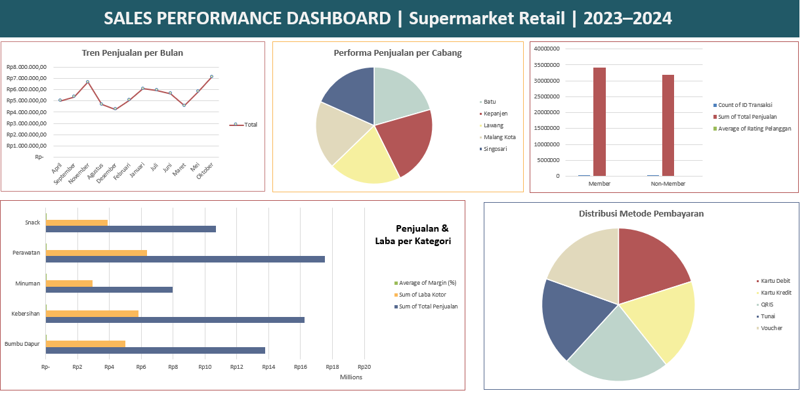

# Supermarket Retail Sales Analysis
### Sales Performance Dashboard | 2023–2024

> **Tools:** Microsoft Excel · **Dataset:** 1.000 transaksi · 5 Cabang · 5 Kategori Produk  
> **Author:** Dea Alensa

---

## Background


Supermarket retail di Malang Raya menghadapi tantangan dalam memantau performa penjualan secara menyeluruh — dari tren bulanan, kontribusi tiap cabang, hingga perilaku pembayaran pelanggan. Proyek ini menganalisis 1.000 transaksi selama 2023–2024 untuk menghasilkan insight yang dapat langsung ditindaklanjuti oleh manajemen.

---

## Business Questions

1. Kapan penjualan tertinggi dan terendah terjadi sepanjang tahun?
2. Cabang mana yang paling dan paling kurang berkontribusi?
3. Kategori produk mana yang paling menguntungkan?
4. Apakah pelanggan member memberikan nilai lebih dibanding non-member?
5. Metode pembayaran apa yang paling dominan?
6. Kapan jam tersibuk transaksi terjadi?

---

## Overview Bisnis

| Metrik | Nilai |
|---|---|
| Total Transaksi | 1.000 |
| Total Penjualan | Rp 66.176.500 |
| Total Laba Kotor | Rp 24.006.560 |
| Rata-rata Margin | 36,42% |
| Rata-rata Rating Pelanggan | 2,97 / 5 ⚠️ |

> Rating pelanggan rata-rata **di bawah 3** — sinyal awal yang perlu diwaspadai manajemen.

---

## Tren Penjualan Bulanan

**Oktober menjadi bulan terkuat** dengan penjualan Rp 7.122.675, kemungkinan didorong momentum Harbolnas dan kampanye akhir tahun. Sebaliknya, **Desember justru menjadi bulan paling sepi** dengan hanya Rp 4.233.325 — paradoks menarik mengingat Desember adalah bulan liburan dan perayaan.

Pola musiman menunjukkan dua puncak: **Mei–Juli** (pertengahan tahun) dan **Oktober–November** (akhir tahun). Di luar dua periode ini, penjualan cenderung stagnan.

| Bulan | Penjualan | Keterangan |
|---|---|---|
| Oktober | Rp 7.122.675 | 🔝 Tertinggi |
| November | Rp 6.669.550 | |
| Januari | Rp 6.073.025 | |
| Juli | Rp 5.941.225 | |
| Mei | Rp 5.833.150 | |
| Desember | Rp 4.233.325 | 🔻 Terendah |

**Rekomendasi:**
- Siapkan stok ekstra dan kampanye iklan **2 minggu sebelum Oktober**
- Lakukan investigasi mendalam mengapa Desember underperform — apakah karena stok kosong, persaingan promo, atau faktor lain?
- Buat program **"mid-year sale"** di Juni untuk mempertahankan momentum pertengahan tahun

---

## Performa per Cabang

Distribusi penjualan antar cabang relatif merata, namun **Kepanjen secara konsisten memimpin** sementara **Singosari tertinggal dengan gap ~20%** dari cabang terbaik.

| Cabang | Total Penjualan | Share |
|---|---|---|
| Kepanjen | Rp 14.641.150 | 22,1% 🔝 |
| Batu | Rp 13.602.775 | 20,6% |
| Lawang | Rp 13.289.850 | 20,1% |
| Malang Kota | Rp 12.519.975 | 18,9% |
| Singosari | Rp 12.122.750 | 18,3% 🔻 |

Tidak ada satu cabang pun yang mendominasi secara ekstrem — ini sebenarnya tanda positif bahwa manajemen cabang cukup merata. Namun gap Rp 2,5 juta antara Kepanjen dan Singosari tetap perlu diperhatikan.

**Rekomendasi:**
- **Studi banding internal:** Identifikasi apa yang membuat Kepanjen unggul — lokasi, jam operasional, promo lokal, atau kualitas kasir — lalu replikasi ke Singosari
- Pertimbangkan rotasi kasir berprestasi dari Kepanjen ke Singosari sebagai transfer knowledge
- Evaluasi apakah Singosari memerlukan renovasi tampilan toko atau penambahan produk yang lebih relevan dengan demografi sekitar

---

## Analisis Kategori Produk

**Perawatan diri (personal care) menjadi kategori terlaris** dengan total penjualan hampir Rp 17,5 juta — mengindikasikan bahwa pelanggan memprioritaskan produk kesehatan dan kecantikan. Sementara itu, **Minuman menjadi kategori paling lemah** dengan penjualan hanya Rp 7,9 juta.

| Kategori | Total Penjualan | Laba Kotor | Margin |
|---|---|---|---|
| Perawatan | Rp 17.534.850 | Rp 6.369.194 | 36,19% 🔝 |
| Kebersihan | Rp 16.232.700 | Rp 5.846.142 | 36,33% |
| Bumbu Dapur | Rp 13.766.150 | Rp 4.984.455 | 36,59% |
| Snack | Rp 10.674.000 | Rp 3.882.696 | 36,48% |
| Minuman | Rp 7.968.800 | Rp 2.924.073 | 36,52% 🔻 |

Hal menarik: **margin semua kategori hampir identik di kisaran 36%** — menunjukkan penetapan harga yang konsisten dan terkontrol di seluruh lini produk.

**Rekomendasi:**
- **Perluas varian produk Perawatan dan Kebersihan** — ini adalah kategori andalan, pastikan stoknya tidak pernah kosong
- **Dongkrak penjualan Minuman** dengan strategi bundling: beli Snack dapat diskon Minuman, atau tempatkan rak Minuman di dekat kasir sebagai impulse buy
- Pertimbangkan apakah perlu menambah kategori baru (misalnya produk frozen atau bayi) untuk diversifikasi pendapatan

---

## Member vs Non-Member

Komposisi pelanggan terbilang **seimbang** dengan Member sedikit mendominasi. Nilai transaksi keduanya hampir setara — artinya program keanggotaan belum berhasil menciptakan perbedaan spending yang signifikan.

| Segmen | Jumlah Transaksi | Total Penjualan | Avg Rating |
|---|---|---|---|
| Member | 523 (52,3%) | Rp 34.194.525 | 3,00 |
| Non-Member | 477 (47,7%) | Rp 31.981.975 | 2,93 |

Meskipun Member sedikit lebih puas (rating 3,00 vs 2,93), **keduanya masih di bawah angka kepuasan yang ideal**. Program member seharusnya menciptakan loyalitas yang jauh lebih kuat dari sekadar selisih 0,07 poin rating.

**Rekomendasi:**
- **Redesain program member** agar lebih menarik: poin reward, diskon ulang tahun, akses promo eksklusif, atau layanan antrean prioritas
- Target jangka pendek: **konversi 20% Non-Member menjadi Member** dengan insentif daftar gratis + cashback transaksi pertama
- Investigasi akar masalah rating rendah (2,97) melalui survei kepuasan — apakah isu antrian, kebersihan toko, ketersediaan produk, atau layanan kasir?

---

## Distribusi Metode Pembayaran

**QRIS menjadi raja pembayaran** dengan kontribusi terbesar, mencerminkan tingginya adopsi digital payment di kalangan pelanggan. Meski begitu, semua metode terdistribusi cukup merata — artinya pelanggan datang dari berbagai segmen.

| Metode | Total Penjualan | Share |
|---|---|---|
| QRIS | Rp 14.678.550 | 22,2% 🔝 |
| Kartu Debit | Rp 14.009.350 | 21,2% |
| Kartu Kredit | Rp 12.662.325 | 19,1% |
| Tunai | Rp 12.486.525 | 18,9% |
| Voucher | Rp 12.339.750 | 18,6% |

Tunai masih bertahan di angka 18,9% — menunjukkan bahwa segmen pelanggan tradisional masih signifikan dan tidak boleh diabaikan.

**Rekomendasi:**
- **Berikan cashback atau poin ekstra** untuk transaksi QRIS guna mendorong adopsi lebih lanjut sekaligus mengurangi biaya pengelolaan uang tunai
- Jangan hapus opsi tunai — hampir 1 dari 5 pelanggan masih mengandalkannya
- Evaluasi program Voucher agar lebih menarik, karena saat ini kontribusinya paling rendah

---

## Pola Jam Transaksi

**Sore hari (16.00–20.00) adalah peak hour** dengan penjualan tertinggi. Ini adalah pola umum supermarket — pelanggan berbelanja sepulang kerja atau sekolah. Menariknya, jam malam masih ramai, mengindikasikan banyak pelanggan yang berbelanja santai di malam hari.

| Jam | Total Penjualan | Keterangan |
|---|---|---|
| Sore (16–20) | Rp 18.203.850 | 🔝 Peak hour |
| Siang (12–16) | Rp 16.826.650 | |
| Malam (20–22) | Rp 15.657.625 | |
| Pagi (08–12) | Rp 15.488.375 | 🔻 Paling sepi |

**Rekomendasi:**
- **Tambah jumlah kasir di jam sore** untuk mengurangi antrian dan meningkatkan kepuasan pelanggan
- Buat **"Promo Pagi"** dengan diskon terbatas untuk mendorong pelanggan datang lebih awal dan meratakan beban operasional
- Pertahankan jam malam — segmen ini cukup besar dan seringkali diabaikan kompetitor

---

## Ringkasan Rekomendasi Bisnis

| Prioritas | Rekomendasi | Dampak yang Diharapkan |
|---|---|---|
| 🔴 Tinggi | Investigasi dan perbaikan rating pelanggan (2,97) | Retensi pelanggan jangka panjang |
| 🔴 Tinggi | Kampanye terencana menjelang Oktober | +10–15% penjualan di bulan puncak |
| 🟡 Menengah | Replikasi strategi Kepanjen ke Singosari | Tutup gap 20% antar cabang |
| 🟡 Menengah | Redesain program member dengan reward lebih menarik | Konversi Non-Member & tingkatkan spending |
| 🟢 Rendah | Bundling Minuman + Snack sebagai cross-sell | Angkat kategori Minuman yang stagnan |
| 🟢 Rendah | Flash sale pagi hari | Kurangi beban peak hour sore |

---

## Metode Analisis

Data diolah menggunakan **Microsoft Excel** melalui tiga tahap: data cleaning (validasi missing values, penyeragaman format kolom), pembuatan 5 pivot table untuk agregasi per dimensi waktu, lokasi, produk, dan pelanggan, serta visualisasi dalam bentuk dashboard dengan 5 chart. Seluruh angka dalam dokumen ini bersumber langsung dari hasil pivot table.

---

## File Structure

```
supermarket-sales-analysis/
│
├── Supermarket_DataOlahan.xlsx    # File utama (Data + Pivot + Dashboard)
├── supermarket_raw.csv            # Data mentah sebelum diolah
└── README.md                      # Dokumentasi ini
```

---

*Dea Alensa — Data Analyst Portfolio | April 2026*
